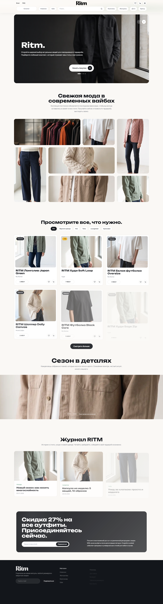
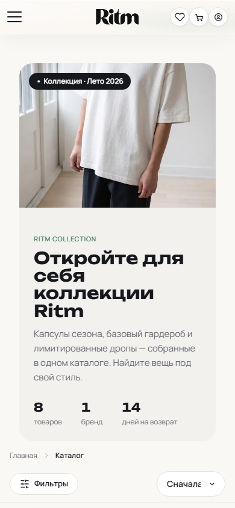
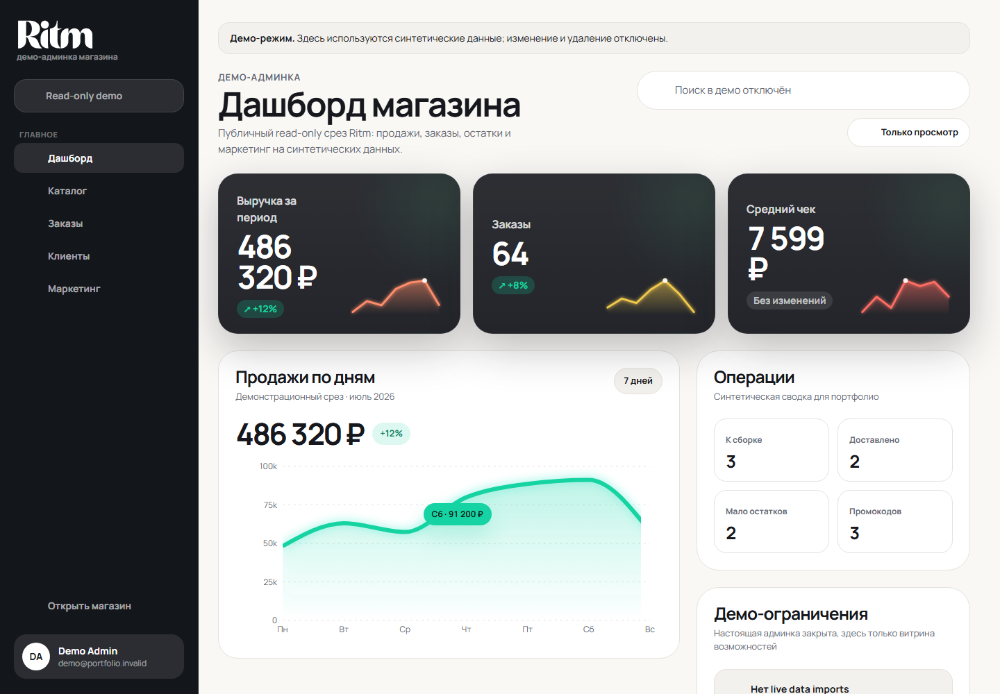
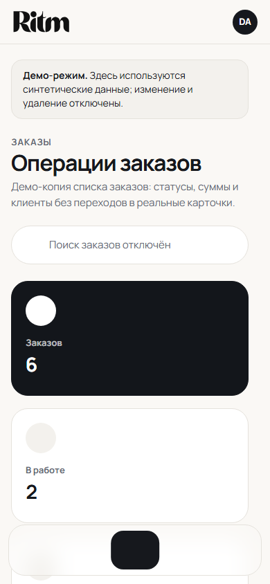

# RITM - full-stack fashion commerce

Production-style portfolio project: storefront, account, sandbox checkout, order lifecycle, reviews, marketing, and a separate read-only admin showcase.

[Production target](https://ritm-app-eight.vercel.app) · [Demo admin path](/demo-admin) · [Source](https://github.com/ui-ux-promax/ritm-app)

## Walkthrough









## What the project demonstrates

- A responsive fashion storefront with catalog, PDP, cart, wishlist, account, orders, reviews, newsletter, and delivery choices.
- A public `/demo-admin` that exposes a synthetic, read-only operational snapshot without real admin mutations.
- A private `/admin` that remains server-authorized through Auth.js and the ADMIN role.
- A checkout path protected for `YooKassa sandbox` when the portfolio demo mode is enabled.

## Feature matrix

| Area | Included |
| --- | --- |
| Shopping | Storefront, catalog, product detail, cart, wishlist |
| Customer | Auth.js, verification, profile, customer orders |
| Commerce | Delivery calculation, coupons, YooKassa sandbox checkout |
| Engagement | Reviews, newsletter, editorial content |
| Operations | Private admin, catalog, orders, customers, marketing |
| Portfolio | Public read-only `/demo-admin` with synthetic fixtures |

## Tech stack

- Next.js 15, React, TypeScript, Tailwind CSS
- Prisma with Neon Postgres
- Auth.js for identity and role boundaries
- YooKassa sandbox for portfolio payment flows
- Upstash for rate limits, Sentry for error monitoring
- GitHub Actions for the quality gate; Vercel for deployment

## Architecture

See [the portfolio production demo architecture](docs/architecture/portfolio-production-demo.md).

## Security and reliability

- Security headers and verification steps: [security verification](docs/operations/security-verification.md)
- Protected daily fixture recovery: [demo data runbook](docs/operations/demo-data-runbook.md)
- Recovery rehearsal template: [recovery rehearsal](docs/operations/recovery-rehearsal.md)

## CI and verification

The repository includes Prisma generation, typecheck, Vitest, build, security checks, deployment smoke coverage, and a deterministic portfolio capture command.

```bash
npm run prisma:generate
npm run typecheck
npm test
npm run build
```

To capture public portfolio screens, set `PORTFOLIO_BASE_URL` to an approved deployment and run `npm run portfolio:capture`.

## Local setup

```bash
npm ci
cp .env.example .env
npm run prisma:generate
npm run dev
```

Use `.env.example` as the variable reference. Keep credentials out of git and use only sandbox payment credentials for `DEMO_MODE=true`.

## Portfolio limitations

- Payments are YooKassa sandbox flows: no real charge is intended.
- The public demo admin contains only synthetic data and has no write actions.
- Operational checks depend on the approved deployment environment; the project does not offer an SLA.
- Production release claims are made only after the release checklist has current external evidence.
