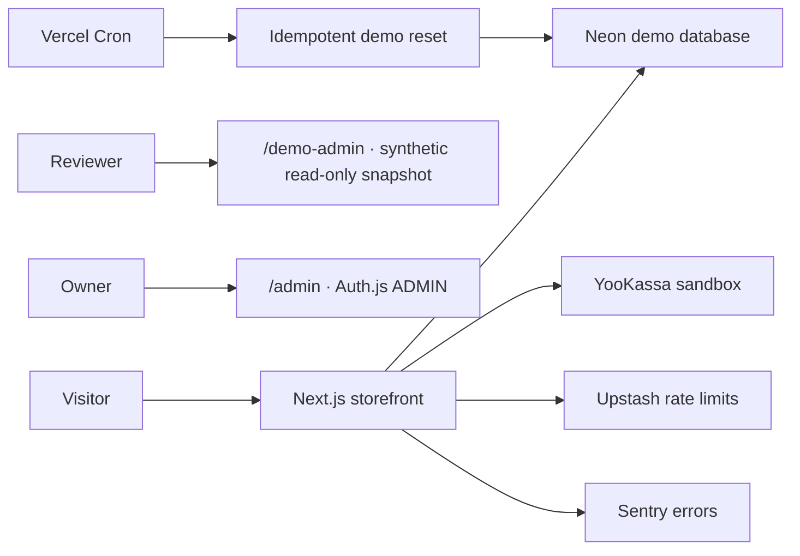

# Portfolio Production Demo Architecture

The storefront and demo admin are separate public experiences. The demo admin reads only static synthetic fixtures and has no Prisma, Auth.js, or mutation path. The real owner admin remains server-authorized and is not linked from demo-admin controls.

The public demo admin is a presentation surface, not a proxy to Neon or the private admin. Its pages deliberately exclude live imports and all write actions. Demo reset protects canonical fixture state independently of the presentation layer.
